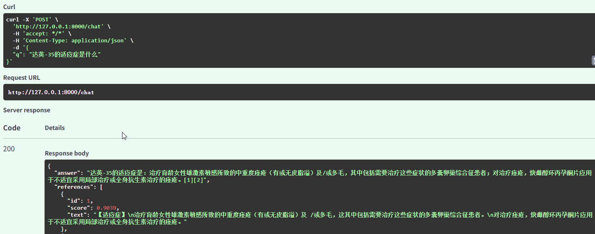
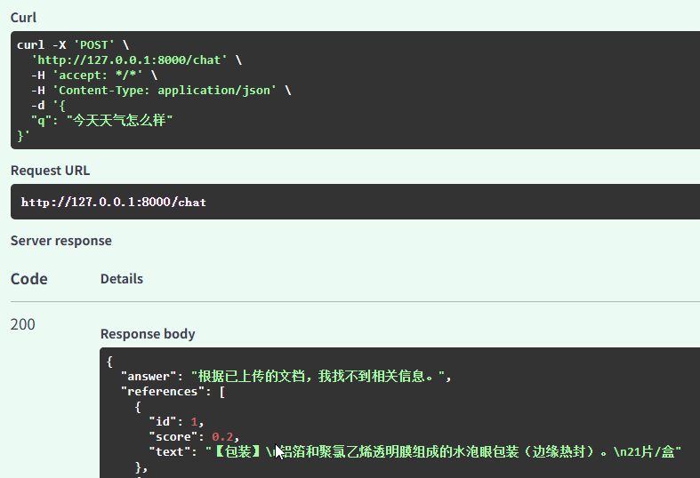

# 企业文档智能问答系统（RAG）

基于 RAG（Retrieval-Augmented Generation）的文档智能问答系统。上传 PDF/TXT 文档后，系统自动解析、清洗、切分、向量化并存储；提问时通过 **BM25 + 向量混合检索** 召回最相关的 TopK 片段，交给大模型生成答案，并返回引用来源。

## 目录

- [功能特性](#功能特性)
- [技术栈](#技术栈)
- [系统架构](#系统架构)
- [快速开始](#快速开始)
- [API 文档](#api-文档)
- [效果截图](#效果截图)
- [项目结构](#项目结构)
- [设计取舍](#设计取舍)
- [已知限制](#已知限制)
- [后续优化](#后续优化)

---

## 功能特性

- 📄 **文档上传**：支持 PDF / TXT，自动解析文本内容
- 🧹 **文本清洗**：正则合并 PDF 断行、过滤图表噪声，提升 chunk 质量
- ✂️ **结构化切分**：说明书类文档按 `【】` 标题切分，普通文档滑动窗口切分（chunk 400 / overlap 80）
- 🔍 **混合检索**：BM25（jieba 分词）+ 向量余弦相似度，加权融合排序
- 🤖 **LLM 生成**：接入 DeepSeek，答案带 `[1][2]` 引用标注
- 📎 **引用溯源**：返回引用原文片段及相似度分数
- 🚫 **抑制幻觉**：检索不到相关内容时明确拒答，实测文档外问题零编造
- 💾 **向量持久化**：本地存储，重启不丢失

---

## 技术栈

| 组件      | 选型                     | 说明                                     |
| --------- | ------------------------ | ---------------------------------------- |
| Web 框架  | FastAPI                  | 自带 Swagger UI，调试方便                |
| LLM       | DeepSeek `deepseek-chat` | OpenAI 兼容协议，中文效果好、成本低      |
| Embedding | 硅基流动 `BAAI/bge-m3`   | 1024 维，中文语义强，免费额度充足        |
| 检索      | BM25 + 向量              | `rank_bm25` + `jieba` + NumPy 余弦相似度 |
| 向量存储  | NumPy 自实现             | 百级 chunk 规模，暴力检索毫秒级返回      |
| PDF 解析  | pypdf                    | 纯 Python，无系统依赖                    |
| 前端      | Swagger UI               | `/docs` 开箱即用                         |

---

## 系统架构

```
┌─────────────────────────── 上传链路 ───────────────────────────┐
│                                                                │
│  PDF/TXT ──► [pypdf 解析] ──► [文本清洗] ──► [结构化切分]      │
│                                                    │           │
│                                                    ▼           │
│                                          [bge-m3 Embedding]    │
│                                                    │           │
│                                       ┌────────────┴────────┐  │
│                                       ▼                     ▼  │
│                                  vectors.npy          chunks.json
│                                       │                     │  │
│                                       └──────► BM25 索引 ◄──┘  │
└────────────────────────────────────────────────────────────────┘

┌─────────────────────────── 问答链路 ───────────────────────────┐
│                                                                │
│  用户提问                                                       │
│     │                                                          │
│     ├──► [Embedding] ──► 向量分数 ──┐                          │
│     │                               ├──► 加权融合 ──► TopK     │
│     └──► [jieba 分词] ──► BM25 分数 ┘        │                 │
│                                              ▼                 │
│                                    [拼接 Prompt + 引用编号]     │
│                                              │                 │
│                                              ▼                 │
│                                        [DeepSeek]              │
│                                              │                 │
│                                              ▼                 │
│                                     答案 + 引用来源             │
└────────────────────────────────────────────────────────────────┘
```

---

## 快速开始

### 1. 克隆 & 安装

```bash
git clone https://github.com/ZzoiLi/rag-demo.git
cd rag-demo

# 创建虚拟环境
python -m venv .venv

# Windows
.venv\Scripts\Activate.ps1
# macOS / Linux
source .venv/bin/activate

# 安装依赖
pip install -r requirements.txt
```

### 2. 配置 API Key

复制 `.env.example` 为 `.env`，填入你的 Key：

```env
DEEPSEEK_API_KEY=sk-xxxxxxxxxxxxxxxx
SILICONFLOW_API_KEY=sk-xxxxxxxxxxxxxxxx
```

| Key      | 获取地址                      | 备注               |
| -------- | ----------------------------- | ------------------ |
| DeepSeek | https://platform.deepseek.com | 充值 10 元够用很久 |
| 硅基流动 | https://siliconflow.cn        | `BAAI/bge-m3` 免费 |

### 3. 启动服务

```bash
uvicorn main:app --reload
```

打开 http://127.0.0.1:8000/docs 使用 Swagger UI 交互。

---

## API 文档

### `POST /api/doc/upload` — 上传文档

**请求**：

```
Content-Type: multipart/form-data

file: <你的文件.pdf>
```

**响应**：

```json
{
  "filename": "炔雌醇环丙孕酮片说明书.pdf",
  "chars": 8231,
  "new_chunks": 45,
  "total_chunks": 45
}
```

| 字段           | 含义                  |
| -------------- | --------------------- |
| `chars`        | 解析 + 清洗后的字符数 |
| `new_chunks`   | 本次新增的 chunk 数   |
| `total_chunks` | 向量库中的总 chunk 数 |

---

### `POST /chat` — 提问

**请求**：

```json
{
  "q": "达英-35的适应症是什么？"
}
```

**响应**：

```json
{
  "answer": "根据资料，达英-35的适应症为：治疗育龄女性雄激素敏感所致的中重度痤疮（有或无皮脂溢）及/或多毛，这其中包括需要治疗这些症状的多囊卵巢综合征患者 [1]。",
  "references": [
    {
      "id": 1,
      "score": 0.9039,
      "text": "【适应症】\n治疗育龄女性雄激素敏感所致的中重度痤疮（有或无皮脂溢）及/或多毛……"
    }
  ]
}
```

| 字段                 | 含义                                          |
| -------------------- | --------------------------------------------- |
| `answer`             | LLM 生成的答案，`[n]` 对应 references 中的 id |
| `references[].score` | 混合检索融合分，越高越相关                    |
| `references[].text`  | 引用的原文片段                                |

---

### `GET /` — 健康检查

```json
{
  "status": "ok",
  "chunks": 45
}
```

---

## 效果截图

### 上传文档


### 文档内提问（带引用）


### 文档外提问（拒答）


---

## 项目结构

```
rag-demo/
├── main.py                    # FastAPI 入口，路由定义
├── rag.py                     # 核心逻辑：解析 / 清洗 / 切分 / 检索 / prompt
├── debug.py                   # 检索诊断脚本
├── requirements.txt
├── .env.example               # 环境变量模板
├── .gitignore
├── data/                      # 运行时数据（gitignore）
│   ├── uploads/               # 上传的原始文件
│   └── store/                 # chunks.json + vectors.npy
└── docs/
    └── screenshots/           # README 用图
```

---

## 设计取舍

### 1. 混合检索（BM25 + 向量）

纯向量检索在本项目的药品说明书场景下失败：用户提问常用**商品名**（"达英-35"），而【适应症】章节只写**通用名**（"炔雌醇环丙孕酮片"），且商品名在全文档高频出现（45 个 chunk 中 30+ 个含"达英"）。

- **纯向量**：目标段落相似度仅 0.4319，排第 12 位，TopK=6 无法召回
- **混合检索**：BM25 的 IDF 机制自动抑制高频词（"达英"）、强化稀有词（"适应症"），在向量 : BM25 = 0.2 : 0.8 权重下，目标段落跃居第 1

这是工业界 RAG 系统普遍采用混合检索的根本原因——**稠密向量擅长语义泛化，稀疏检索擅长精确术语匹配，两者互补**。

### 2. 结构化切分

- **普通文档**：400 字滑动窗口 + 80 字 overlap，防止句子被切断
- **说明书类文档**：`【】` 标题出现 ≥ 5 次时，改按 `【】` 标题切分，每块是完整小节，语义纯度更高

chunk 从最初的 600 字降到 400 字，是因为 600 字时"适应症"这类短查询关键词被长 chunk 中的无关内容稀释严重。

### 3. 拒答规则抑制幻觉

检索必然带回部分无关片段，system prompt 明确要求：

> 只使用资料中的信息，不要编造资料之外的内容。如果资料中没有相关信息，直接回答"根据已上传的文档，我找不到相关信息"。

配合 `temperature=0.3`（RAG 要求忠实复述而非发挥），实测文档外问题零编造。

### 4. 向量库用 NumPy 自实现

- 项目规模在百级 chunk，暴力检索毫秒级返回，无需引入向量数据库
- 自实现便于理解检索原理，面试时能讲清余弦相似度、归一化、TopK 选取的每一步
- 接口已封装，后续可无缝替换为 PgVector / Milvus / Qdrant

### 5. PDF 文本清洗

pypdf 提取双栏 PDF 时会把每个文本块单独输出，产生"每字一行"的脏文本：

```
2023
年
3
月
10
日
```

同时会把图表的权重数据（`0.016*"friction"`）当正文抓入。通过两组正则处理：

1. 合并被换行拆散的中文/英文词
2. 过滤形如 `\d+\.\d+\*"[^"]*"` 的图表噪声

清洗后 chunk 质量显著提升。

---

## 已知限制

- **扫描版 PDF 不支持**：图片型 PDF 无法用 pypdf 提取文本，需接入 OCR（如 PaddleOCR）
- **无去重**：重复上传同一文件会追加 chunk，未做哈希去重
- **权重固定**：向量 : BM25 = 0.2 : 0.8 为经验值，未做自适应或网格搜索
- **无页码元数据**：引用只能定位到 chunk，无法定位到具体页码
- **单轮问答**：未处理多轮对话的指代消解

---

## 后续优化

- [ ] 接入 rerank 模型（如 `bge-reranker-v2-m3`）对 TopK 结果精排
- [ ] chunk 元数据记录来源文件名 + 页码，引用可精确定位
- [ ] Query 改写 / 同义词扩展，处理商品名 ↔ 通用名映射
- [ ] 引入对话历史，支持多轮追问
- [ ] 上传去重（文件哈希）与文档删除接口
- [ ] 前端页面（当前仅 Swagger UI）

---

## 作者

**ZzoiLi** — 个人项目，用于 RAG 技术学习与求职展示。想·